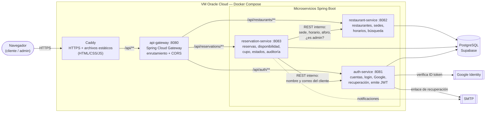
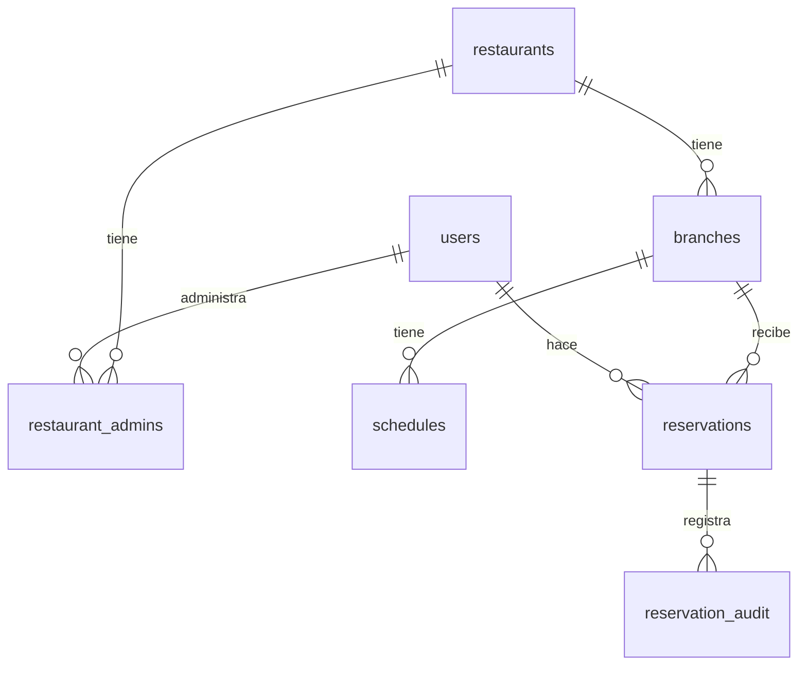
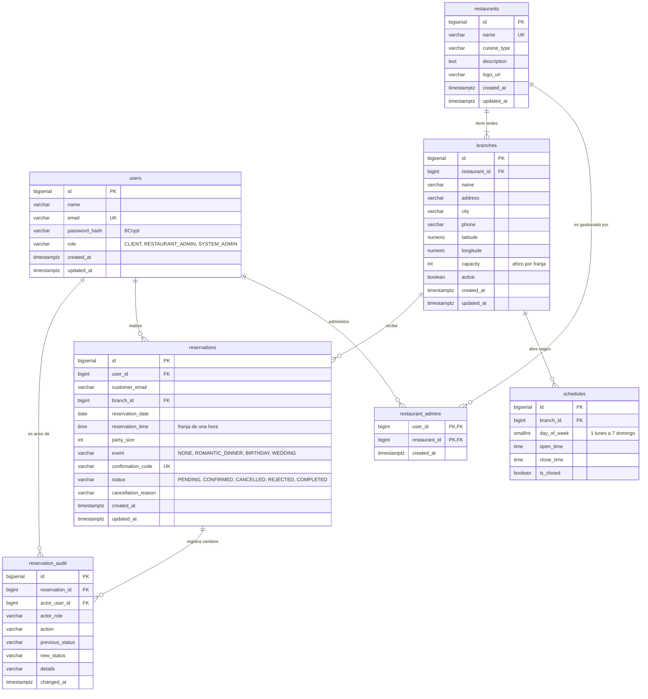
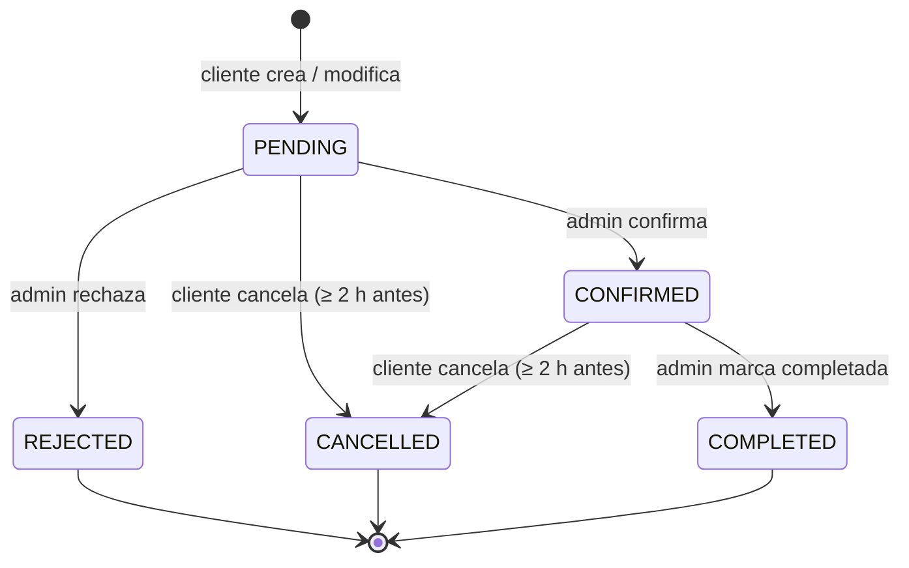
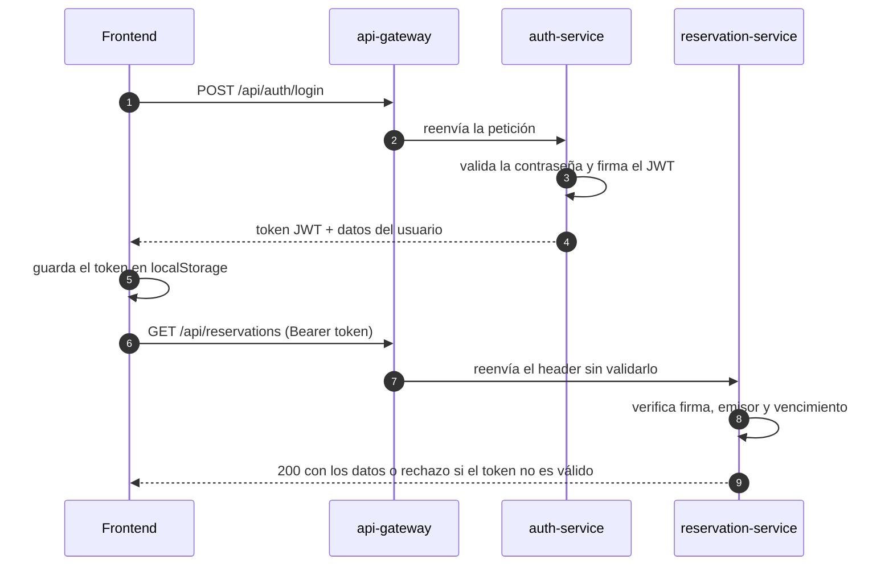

# ReservaYa

Plataforma web para **reservar mesa en restaurantes** del área metropolitana de
Bucaramanga. Proyecto de la materia Entornos de Programación, UIS 2026.

- **Producción:** https://reservaya.duckdns.org
- **Enunciado y requisitos:** [`Entrega 1 - Proyecto EP.pdf`](./Entrega%201%20-%20Proyecto%20EP.pdf)
- **Detalle técnico del backend:** [`backend/README.md`](./backend/README.md)
- **Guía visual del frontend:** [`frontend/README.md`](./frontend/README.md)
- **Análisis de arquitectura, POO y SOLID:** [`docs/analisis-poo-solid.md`](./docs/analisis-poo-solid.md)

> El código más reciente está en la rama **`backend`**. Trabaja sobre esa rama
> hasta que se fusione con `main`.

---

## Contenido

1. [¿Qué es ReservaYa?](#1-qué-es-reservaya)
2. [Arquitectura](#2-arquitectura)
3. [Diseño de la base de datos](#3-diseño-de-la-base-de-datos)
4. [Ciclo de vida de una reserva](#4-ciclo-de-vida-de-una-reserva)
5. [Seguridad: autenticación con JWT](#5-seguridad-autenticación-con-jwt)
6. [Ejecutarlo en local](#6-ejecutarlo-en-local)
7. [Manual de uso](#7-manual-de-uso)
8. [Estado del proyecto](#8-estado-del-proyecto)
9. [Despliegue en producción](#9-despliegue-en-producción)
10. [Problemas frecuentes](#10-problemas-frecuentes)

---

## 1. ¿Qué es ReservaYa?

Hoy muchos restaurantes toman reservas por teléfono o WhatsApp: no se ve la
disponibilidad real, se cruzan reservas y el cliente no sabe si su mesa quedó
apartada. ReservaYa centraliza ese proceso.

Hay dos tipos de usuario:

| Usuario | Qué hace |
|---|---|
| **Cliente** | Busca restaurantes por nombre, ciudad o tipo de cocina, ve los horarios con cupo, reserva en dos pasos y gestiona sus reservas (modificar, cancelar, historial). |
| **Administrador de restaurante** | Registra su restaurante (la "marca") y sus **sedes**, con dirección, horario de cada día y aforo. |

Conceptos clave:

- **Restaurante** = la marca (ej. "Restaurante Doña Marta"). **Sede** = un local
  físico con su dirección, horario y aforo. **Se reserva en una sede.**
- El día se divide en **franjas de una hora** dentro del horario de la sede.
  Cada franja admite tantas personas como el aforo de la sede.
- Una reserva nace **Pendiente**; el restaurante la **confirma** o la
  **rechaza**, y al final queda **Completada**. El cliente puede **cancelarla**
  o **modificarla** hasta 2 horas antes.

---

## 2. Arquitectura

ReservaYa es un backend de **cuatro microservicios Spring Boot** detrás de un
gateway, más un frontend estático. En producción todo corre en una VM de
Oracle Cloud con Docker Compose, y Caddy sirve el frontend con HTTPS.



En local no hay Caddy: el frontend lo sirve `server.js` en el puerto 3000 y
llama directamente al gateway en `http://localhost:8080`.

| Parte | Tecnología |
|---|---|
| Frontend | HTML, CSS y JavaScript sin frameworks. `server.js` (Node) solo sirve los archivos en local. |
| Backend | Java 21, Spring Boot 4, 4 microservicios con Maven Wrapper (no hace falta instalar Maven). |
| Base de datos | PostgreSQL en Supabase. El esquema está en [`backend/db/schema.sql`](./backend/db/schema.sql). |
| Seguridad | Contraseñas con BCrypt, sesiones con JWT, inicio de sesión con Google. |
| Producción | Docker Compose y Caddy (HTTPS automático) en una VM de Oracle Cloud. |

### Estructura del repositorio

```
ReservaYaEP-2026-2/
├── backend/
│   ├── api-gateway/            enrutamiento y CORS
│   ├── auth-service/           registro, login, Google, recuperación de cuenta
│   ├── restaurant-service/     restaurantes, sedes, horarios, búsqueda
│   ├── reservation-service/    reservas, disponibilidad, validación de aforo
│   ├── db/schema.sql           tablas de la base de datos
│   ├── db/migrations/          cambios aditivos para una base ya creada
│   ├── caddy/Caddyfile         servidor web de producción
│   ├── docker-compose.yml      despliegue de producción
│   ├── run-dev.ps1             arranque rápido en local (Windows)
│   └── .env.example            plantilla de variables de entorno
├── docs/                       SRS y análisis de POO / SOLID
└── frontend/
    ├── html/                   páginas (index, login, recuperar, cliente, admin)
    ├── js/                     lógica de cada página + server.js
    ├── styles/styles.css       todo el estilo
    └── images/
```

---

## 3. Diseño de la base de datos

Una sola base PostgreSQL en Supabase con **7 tablas**. Cada microservicio es
dueño de sus tablas y no consulta las de otro servicio (para eso usa los
endpoints REST internos). Las llaves foráneas sí cruzan esos límites, porque
viven en la misma base y así se garantiza la integridad referencial (RNF-10).

### 3.1 Relaciones entre tablas



### 3.2 Diagrama entidad-relación con columnas



### 3.3 Qué guarda cada tabla

| Tabla | Servicio dueño | Qué guarda |
|---|---|---|
| `users` | `auth-service` | Clientes y administradores, con la contraseña en BCrypt y su rol. |
| `restaurants` | `restaurant-service` | La **marca** del restaurante (nombre único, tipo de cocina, descripción). |
| `branches` | `restaurant-service` | Cada **sede** física: dirección, ciudad, teléfono y aforo por franja. |
| `schedules` | `restaurant-service` | El horario de cada sede, un registro por día de la semana. |
| `restaurant_admins` | `restaurant-service` | Qué usuario administra qué marca. El JWT trae el rol; esta tabla dice sobre qué marca puede actuar. |
| `reservations` | `reservation-service` | Las reservas: sede, fecha, hora, personas, evento, código de confirmación y estado. |
| `reservation_audit` | `reservation-service` | Historial de cada cambio de estado: quién lo hizo, con qué rol y el estado anterior y nuevo. |

### 3.4 Reglas que impone la base

- **Correo único** por usuario y **nombre único** por marca; una sede no puede
  repetir nombre dentro de su marca.
- **Aforo** de la sede entre 1 y 500 personas; **personas por reserva** entre 1 y 50.
- **Un horario por día** y por sede, con la hora de cierre después de la de
  apertura (salvo si el día está marcado como cerrado).
- Roles, estados y eventos se guardan como `VARCHAR` con `CHECK`, así solo se
  aceptan los valores válidos.
- **Sin reservas duplicadas:** un índice único parcial impide que un cliente
  tenga dos reservas activas (`PENDING` o `CONFIRMED`) en la misma sede,
  fecha y hora, pero le deja volver a reservar si canceló.
- `updated_at` se actualiza con un trigger en cada `UPDATE`.
- Los servicios arrancan con `ddl-auto=validate`: Hibernate no crea tablas,
  solo comprueba que las entidades coinciden con la base.

El cupo disponible de una franja es el aforo de la sede menos las personas de
las reservas `PENDING` y `CONFIRMED` en esa fecha y hora. Por eso, al cancelar
o rechazar una reserva, el cupo se libera solo.

### 3.5 Esquema y migraciones

| Archivo | Cuándo usarlo |
|---|---|
| [`schema.sql`](./backend/db/schema.sql) | Base nueva. **Borra todas las tablas** y las crea de cero. |
| [`V2__reservation_management.sql`](./backend/db/migrations/V2__reservation_management.sql) | Base ya creada: agrega `customer_email` y la tabla `reservation_audit`. |
| [`V3__schedules_iso_days.sql`](./backend/db/migrations/V3__schedules_iso_days.sql) | Base ya creada: pasa los días de la semana al formato ISO (1 = lunes … 7 = domingo). |
| [`V4__reservation_event_and_code.sql`](./backend/db/migrations/V4__reservation_event_and_code.sql) | Base ya creada: agrega el tipo de evento y el código de confirmación. |

Más detalle (decisiones de diseño y cálculo de disponibilidad) en
[`backend/db/README.md`](./backend/db/README.md).

---

## 4. Ciclo de vida de una reserva



Cada cambio de estado queda registrado en `reservation_audit`. Si el cliente
modifica una reserva, esta vuelve a `PENDING` hasta que el restaurante la
confirme de nuevo. Las 2 horas de anticipación se configuran con
`MIN_HOURS_BEFORE_CANCEL`.

---

## 5. Seguridad: autenticación con JWT

Solo `auth-service` **firma** el token; `restaurant-service` y
`reservation-service` lo **verifican** con el mismo secreto (`JWT_SECRET`), sin
consultar a nadie. El gateway solo reenvía el header `Authorization`.



- El token lleva el id del usuario (`sub`), su correo, nombre y **rol**, y
  vence a los 120 minutos (`JWT_EXPIRATION_MINUTES`).
- Cada servicio tiene un `JwtAuthenticationFilter` que valida el token antes
  de llegar al controlador. Los servicios no guardan sesión (`STATELESS`).
- Además del rol, se valida el **dueño del recurso**: un administrador solo
  gestiona las sedes de sus restaurantes y un cliente solo sus reservas.

---

## 6. Ejecutarlo en local

### 6.1 Requisitos

| Herramienta | Versión | Cómo comprobarla |
|---|---|---|
| Git | cualquiera | `git --version` |
| JDK | **21 o superior** (con 17 no arranca) | `java -version` |
| Node.js | 18 o superior | `node --version` |

No hace falta instalar Maven ni ninguna dependencia de Node.

### 6.2 Descargar el proyecto

```bash
git clone https://github.com/DeiviCode99/ReservaYaEP-2026-2.git
cd ReservaYaEP-2026-2
git checkout backend
```

### 6.3 Configurar las variables de entorno

```bash
cd backend
cp .env.example .env        # en PowerShell: Copy-Item .env.example .env
```

Abre `backend/.env` y rellena los valores. **Pídele los valores reales al
líder del equipo por un canal privado**: el `.env` nunca se sube al
repositorio (ya está en `.gitignore`).

| Variable | Obligatoria | Para qué |
|---|---|---|
| `SUPABASE_DB_URL`, `SUPABASE_DB_USER`, `SUPABASE_DB_PASSWORD` | Sí | Conexión a la base de datos |
| `JWT_SECRET` | Sí | Firma de las sesiones. **Mínimo 32 caracteres** o los servicios no arrancan. Genera uno con `openssl rand -base64 48`. |
| `FRONTEND_ORIGIN` | Sí | En local `http://localhost:3000` |
| `GOOGLE_CLIENT_ID` | No | Sin él, el botón de Google no aparece |
| `SPRING_MAIL_*`, `MAIL_FROM` | No | Sin ellos, el enlace de recuperación de cuenta se imprime en la ventana de `auth-service` en vez de enviarse por correo |

Si un valor tiene espacios o `<>`, ponlo entre comillas, como
`MAIL_FROM="ReservaYa <correo@gmail.com>"`.

### 6.4 Base de datos

Si el equipo **ya comparte** un proyecto de Supabase, no hagas nada: las
tablas ya existen.

Solo si vas a usar **tu propia** base de Supabase: abre el SQL Editor, pega
[`backend/db/schema.sql`](./backend/db/schema.sql) y ejecútalo.

> ⚠️ `schema.sql` **borra todas las tablas y sus datos** antes de crearlas.
> Nunca lo ejecutes sobre la base compartida sin avisar al equipo.

### 6.5 Arrancar todo

**Windows (recomendado):** desde la carpeta `backend`:

```powershell
.\run-dev.ps1 -Frontend
```

Se abre una ventana por servicio más una para el frontend. La primera vez
tarda varios minutos porque Maven descarga dependencias. Si PowerShell bloquea
el script:

```powershell
Set-ExecutionPolicy -Scope Process -ExecutionPolicy Bypass
```

**macOS / Linux:** una terminal por servicio, cargando el `.env` en cada una:

```bash
cd backend
set -a; source .env; set +a
cd auth-service && ./mvnw spring-boot:run
# repetir en otras terminales con restaurant-service, reservation-service y api-gateway
```

Y el frontend en otra terminal:

```bash
cd frontend
npm start
```

### 6.6 Comprobar que funciona

1. Abre http://localhost:8080/api/auth/config: debe mostrar un JSON como
   `{"googleClientId":"..."}`. Si da error, algún servicio no arrancó; revisa
   su ventana.
2. Abre **http://localhost:3000** y crea una cuenta.

### 6.7 Pruebas automáticas

No necesitan base de datos:

```bash
cd backend/auth-service        && ./mvnw test -Dtest=AccountFlowTest
cd backend/reservation-service && ./mvnw test -Dtest="ReservationFlowTest,BranchReservationFlowTest"
cd backend/restaurant-service  && ./mvnw test -Dtest=BranchUpdateTest
```

(Las pruebas `*ApplicationTests` sí necesitan la base de datos configurada.)

---

## 7. Manual de uso

Las direcciones son iguales en local (`http://localhost:3000/...`) y en
producción (`https://reservaya.duckdns.org/...`).

### 7.1 Crear una cuenta — `/`

1. Elige cómo vas a usar ReservaYa: **Quiero reservar** (cliente) o
   **Tengo un restaurante** (administrador).
2. Escribe nombre, correo y contraseña (mínimo 8 caracteres), y **repite la
   contraseña**.
3. Pulsa **Crear cuenta**. Entras directamente a tu panel.

**Con Google:** marca el tipo de cuenta y pulsa el botón de Google que aparece
debajo del formulario. Si ya tenías una cuenta con ese correo, entras a ella.

### 7.2 Iniciar sesión — `/login.html`

Correo y contraseña, o el botón de Google. Cada tipo de usuario llega a su
propio panel.

### 7.3 Recuperar la contraseña — `/recuperar.html`

1. En el login, pulsa **¿Olvidaste tu contraseña?**
2. Escribe tu correo y pulsa **Enviar enlace**.
3. Abre el correo "Recupera tu cuenta de ReservaYa" (revisa spam) y pulsa el
   enlace. **Vence en 30 minutos y sirve una sola vez.**
4. Escribe la contraseña nueva dos veces y pulsa **Guardar y entrar**.

Si creaste la cuenta con Google y quieres entrar también con correo y
contraseña, usa este mismo proceso para ponerle una.

### 7.4 Panel del cliente — `/cliente.html`

Arriba ves tres cifras: reservas activas, tu próxima reserva y cuántas hay en
el historial.

**Reservar una mesa (2 pasos):**

1. **Elige la sede.** Al entrar ya aparecen todas. Puedes filtrar por nombre
   del restaurante, ubicación (Bucaramanga, Floridablanca, Girón, Piedecuesta)
   o tipo de cocina. Pulsa **Reservar aquí** en la sede que quieras.
2. **Día, hora y personas.** Elige la fecha: aparecen **solo las horas con
   cupo**, con cuántos puestos quedan. Si la sede no abre ese día o está
   llena, lo verás en un mensaje. Elige la hora, indica cuántas personas van y
   pulsa **Confirmar reserva**.

La reserva queda **Pendiente** hasta que el restaurante la confirme. El abono
que aparece ($50.000 hasta 3 personas, $100.000 desde 4) es informativo.

**Modificar una reserva:** en *Reservas activas* pulsa **Modificar**. Se abre
el paso 2 con tus datos; cambia fecha, hora o personas y pulsa **Guardar
cambios**. Vuelve a quedar Pendiente.

**Cancelar:** pulsa **Cancelar** en la reserva y confirma.

> Modificar y cancelar solo se permite **hasta 2 horas antes** de la reserva.

**Colores de estado:**

| Estado | Color | Significado |
|---|---|---|
| Pendiente | mostaza | Esperando respuesta del restaurante |
| Confirmada | verde | El restaurante la aceptó |
| Cancelada / Rechazada | ladrillo | No se realizará |
| Completada | gris | Ya ocurrió |

### 7.5 Panel del administrador — `/admin.html`

**Primera vez: registra tu restaurante y sus sedes**

1. En *Datos del restaurante* escribe el nombre, el tipo de cocina y, si
   quieres, una descripción. Pulsa **Guardar restaurante**.
2. En *Mis restaurantes*, pulsa **Gestionar sedes**.
3. Llena la sede: nombre, dirección, **ciudad** (de la lista), teléfono,
   **capacidad por franja horaria** y el horario de cada día (marca
   **Cerrado** los días que no atiende). Pulsa **Guardar sede**.

La dirección, el horario y el aforo son de cada sede, no del restaurante:
una marca puede tener varias sedes con horarios distintos.

**Día a día: responder las reservas** — sección *Reservas de tus sedes*

1. Elige la **sede** y la **fecha** (por defecto, hoy). Las reservas salen
   ordenadas por hora, con el nombre y el correo de quien reservó.
2. Arriba ves cuántas hay **por responder**, cuántas están **confirmadas** y
   cuántas **personas** esperas ese día.
3. En cada reserva pendiente pulsa **Confirmar** o **Rechazar**. Al rechazar
   puedes escribir un motivo, que el cliente verá en su panel.
4. Cuando el cliente ya vino, pulsa **Marcar completada**.
5. El filtro **Estado** muestra solo un tipo de reserva (por ejemplo, solo
   las pendientes).

**Desactivar una sede:** edítala y desmarca **Sede activa**. Deja de aparecer
en las búsquedas de los clientes; las reservas que ya tenía siguen en tu panel.

Solo ves y gestionas las reservas de las sedes de **tus** restaurantes.

---

## 8. Estado del proyecto

**Hecho**

- Registro (con confirmación de contraseña), login y recuperación de cuenta
  por correo (RF-01, RF-02, RF-16)
- Inicio de sesión y registro con Google (RF-15)
- Registro de restaurantes y sedes con horarios y aforo (RF-03, RF-13)
- Búsqueda de sedes por nombre, ubicación y tipo de cocina (RF-04)
- Disponibilidad por franja, mostrando solo horas con cupo (RF-05)
- Crear reserva en 2 pasos con validación de aforo (RF-06, RF-07, RNF-01)
- Historial y estados de las reservas del cliente (RF-08)
- Modificar y cancelar con 2 horas de anticipación (RF-09)
- Acceso por rol: cliente o administrador (RF-14)
- Panel del administrador: reservas de sus sedes por fecha y estado, con
  confirmar, rechazar (con motivo) y completar (RF-10, RF-11)
- Activar y desactivar sedes

**Pendiente**

- Correo de confirmación al crear, modificar o cancelar una reserva (RF-12):
  hoy la confirmación es solo en pantalla.
- El abono y el tipo de evento (cumpleaños, boda…) no se guardan en la base.
- Límite de intentos en "olvidé mi contraseña".

---

## 9. Despliegue en producción

La VM corre todo con Docker Compose y Caddy sirve el frontend con HTTPS. Para
publicar cambios que ya estén en la rama `backend`:

```bash
ssh ubuntu@<ip-de-la-vm>
cd reservaya            # la carpeta donde está clonado el repositorio
git pull
cd backend
docker compose up -d --build
docker compose restart caddy
docker compose ps       # todos deben quedar "Up" y el tiempo debe ir subiendo
```

En el `.env` **de la VM**:

```
FRONTEND_ORIGIN=https://reservaya.duckdns.org
DOMAIN=reservaya.duckdns.org
JWT_SECRET=<mínimo 32 caracteres>
```

Si se cambia el `.env`, basta con `docker compose up -d` para que los
servicios lo lean.

---

## 10. Problemas frecuentes

| Síntoma | Causa | Solución |
|---|---|---|
| Un servicio se reinicia en bucle; en el log sale `WeakKeyException ... 200 bits` | `JWT_SECRET` muy corto | Usa uno de 32+ caracteres (`openssl rand -base64 48`) y reinicia |
| Todas las llamadas a `/api` dan **500** | El gateway no alcanza los servicios: están caídos o arrancando | `docker compose ps` y `docker compose logs --tail=60 <servicio>` |
| El login da **403** en producción | Gateway viejo o `FRONTEND_ORIGIN` mal puesto | `git pull`, revisa el `.env` y `docker compose up -d --build` |
| `/login.html` da 404 en producción | Caddy sigue con la configuración vieja | `docker compose up -d --force-recreate caddy` |
| No aparece el botón de Google | `GOOGLE_CLIENT_ID` vacío o backend caído | Revisa `http://localhost:8080/api/auth/config` (en producción, `/api/auth/config`) |
| Google dice `origin_mismatch` | La dirección no está autorizada | En Google Cloud → Clientes → *Orígenes de JavaScript autorizados*, agrega la dirección exacta, sin barra final |
| El correo de recuperación no llega | SMTP sin configurar o contraseña de aplicación mal copiada | Mira el log de `auth-service`: sin SMTP, el enlace aparece ahí |
| Un servicio no arranca con `Schema-validation: missing table` | La base no tiene las tablas | Aplica `schema.sql` (ver 6.4) |
| `run-dev.ps1` dice que un puerto está en uso | Ya hay un servicio corriendo en ese puerto | Ciérralo o déjalo: el script lo omite |
