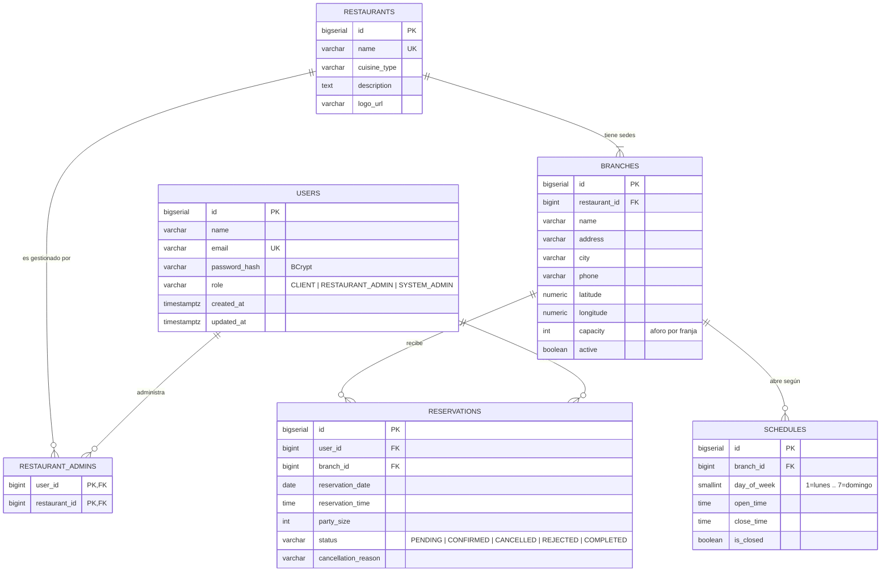

# Base de datos ReservaYa

PostgreSQL alojado en **Supabase**. Una sola base de datos lógica, con las
tablas agrupadas por microservicio: cada servicio es dueño de sus tablas y
**no** consulta las tablas de otro servicio (para eso están los endpoints REST).

Las llaves foráneas sí cruzan esos límites porque viven en la misma base, lo
que garantiza la integridad referencial que exige el **RNF-10**.

---

## Aplicar el esquema

1. Entra al proyecto en Supabase → **SQL Editor** → **New query**.
2. Pega el contenido de [`schema.sql`](./schema.sql) y pulsa **Run**.
3. Verifica en **Table Editor** que aparezcan las 6 tablas.

> `schema.sql` empieza con `DROP TABLE IF EXISTS ... CASCADE`, así que se puede
> volver a ejecutar cuantas veces haga falta durante el desarrollo. **Borra
> todos los datos** cada vez.

Los servicios arrancan con `spring.jpa.hibernate.ddl-auto=validate`: Hibernate
no crea ni modifica tablas, solo comprueba que las entidades JPA coinciden con
lo que hay en la base. Si una entidad no cuadra, el servicio no arranca — que
es justo lo que queremos para no corromper el esquema por accidente.

---

## Diagrama entidad-relación



---

## Qué tabla pertenece a qué servicio

| Servicio | Tablas | Entidades JPA |
|---|---|---|
| `auth-service` | `users` | `User` |
| `restaurant-service` | `restaurants`, `branches`, `schedules`, `restaurant_admins` | `Restaurant`, `Branch`, `Schedule`, `RestaurantAdmin` |
| `reservation-service` | `reservations` | `Reservation` |
| `api-gateway` | — | — |

En `reservation-service` los campos `user_id` y `branch_id` se mapean como
columnas `Long` sueltas (no como `@ManyToOne`), porque las entidades `User` y
`Branch` viven en otros servicios.

---

## Ciclo de vida de una reserva

```
          cliente crea
              │
              ▼
          PENDING ──── admin acepta ───►  CONFIRMED ──── admin marca ───► COMPLETED
              │                               │
    admin rechaza │                           │ cliente cancela
              ▼                               ▼
           REJECTED                       CANCELLED
```

El cliente solo puede cancelar si faltan más de `MIN_HOURS_BEFORE_CANCEL`
horas para la reserva (**RF-09 / HU-06**). Al cancelar, el cupo vuelve a estar
disponible automáticamente, porque el cálculo de ocupación solo cuenta las
reservas en estado `PENDING` o `CONFIRMED`.

---

## Cómo se calcula la disponibilidad (RF-05, RF-07)

`reservation-service` no conoce el aforo: se lo pide a `restaurant-service`.

1. `GET /api/restaurants/{id}/branches/{branchId}` → devuelve `capacity` y el horario del día.
2. Con el horario se generan las franjas de **una hora exacta** entre `open_time` y `close_time`.
3. Para cada franja:

```sql
SELECT b.capacity - COALESCE(SUM(r.party_size), 0) AS cupo_disponible
FROM   branches b
LEFT JOIN reservations r
       ON r.branch_id        = b.id
      AND r.reservation_date = :fecha
      AND r.reservation_time = :hora
      AND r.status IN ('PENDING', 'CONFIRMED')
WHERE  b.id = :branchId
GROUP  BY b.capacity;
```

Solo se le muestran al cliente las franjas con `cupo_disponible >= party_size`
(**HU-04**: "se muestran únicamente los horarios con cupo disponible").

---

## Decisiones de diseño

| Decisión | Por qué |
|---|---|
| `BIGSERIAL` en vez de UUID | Más simple de depurar y es lo estándar en una base relacional docente. |
| `VARCHAR + CHECK` en vez de `ENUM` nativo | El tipo `ENUM` de Postgres obliga a escribir un conversor de Hibernate; con `VARCHAR` basta `@Enumerated(EnumType.STRING)`. Se conserva la validación gracias al `CHECK`. |
| Franja de **una hora exacta** | El aforo se valida contra `reservation_time` sin cálculos de solapamiento. |
| `capacity` en la sede, no una tabla `tables` | El PDF pide "capacidad (número de mesas/aforo)". Una tabla `tables` por mesa individual queda como extensión futura. |
| `day_of_week` de 1 a 7 | Coincide con `java.time.DayOfWeek.getValue()`, así no hay que convertir nada en Java. |
| Índice único parcial en `reservations` | Evita que un cliente duplique su reserva en la misma franja por doble clic, pero deja volver a reservar si canceló. |
| Triggers para `updated_at` | La marca de tiempo es correcta venga el `UPDATE` de donde venga, no solo desde Hibernate. |

---

## Verificación realizada

El esquema se aplicó sobre PostgreSQL 16 y se comprobó que rechaza:
correo duplicado, rol inválido, aforo 0, horario duplicado para el mismo día,
hora de cierre anterior a la de apertura, reserva duplicada en la misma franja,
estado inválido y referencia a un usuario inexistente. También se verificó que
cancelar libera la franja y que `updated_at` se actualiza solo.
