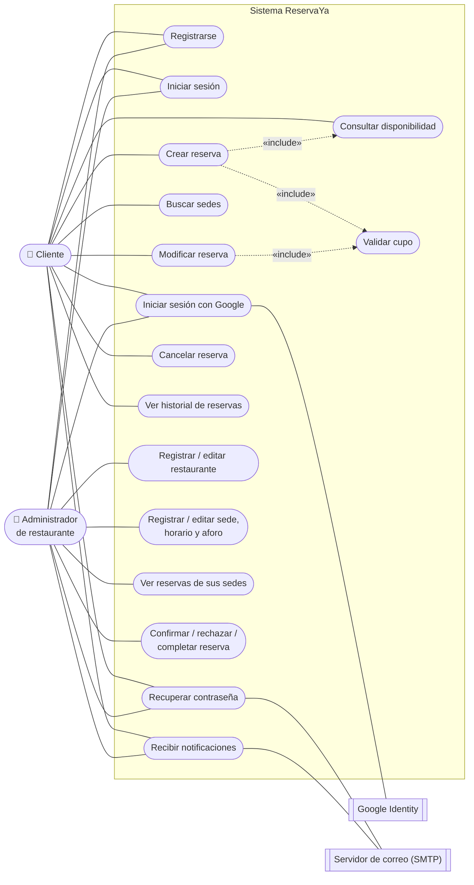
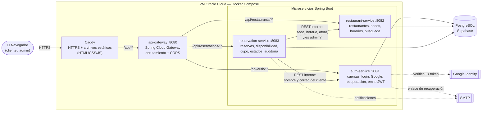
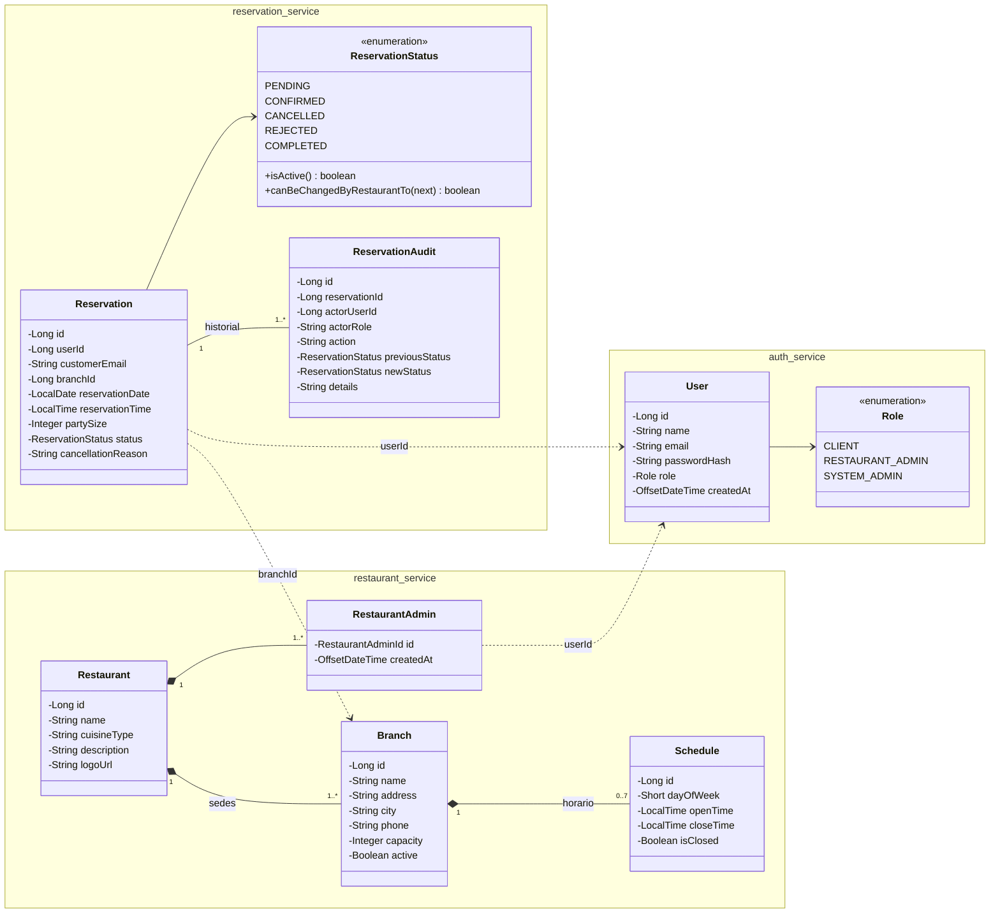
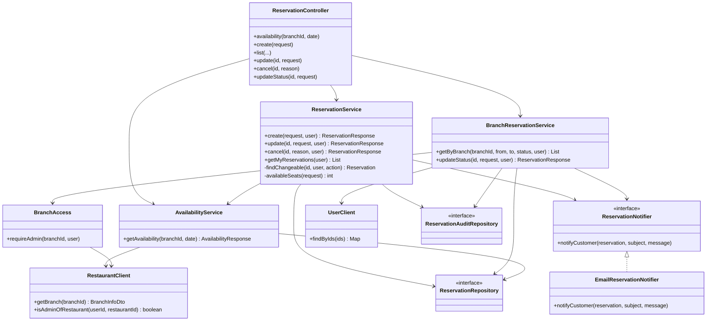

# ReservaYa — Especificación de Requisitos de Software (SRS resumido)

**Proyecto:** Plataforma web para reserva de restaurantes
**Asignatura:** Entornos de Programación — UIS, 2026-2
**Equipo:** Ivan Herrera (Product Owner / dev), Juan Rangel (dev), David Zapata (Scrum Master / dev)
**Producción:** https://reservaya.duckdns.org
**Versión del documento:** 1.0 — octubre 2026 (rama `backend`)

> Este documento recoge los requisitos **más importantes** del sistema y cómo
> quedaron implementados. No es exhaustivo: el detalle operativo está en el
> [README](../README.md) y el análisis de diseño en
> [analisis-poo-solid.md](./analisis-poo-solid.md).

---

## 1. Introducción

### 1.1 Propósito
Describir qué hace ReservaYa, quién lo usa, cuáles son sus requisitos clave y
cómo se diseñó e implementó para cumplirlos.

### 1.2 Problema
Muchos restaurantes toman reservas por teléfono o WhatsApp: no hay
disponibilidad en tiempo real, se cruzan reservas (*overbooking*), el cliente
no sabe si su mesa quedó apartada y el restaurante no tiene historial de
ocupación. ReservaYa centraliza ese proceso en una sola plataforma web.

### 1.3 Alcance
**Incluye:** registro y autenticación (correo/contraseña y Google),
recuperación de cuenta, registro de restaurantes con varias sedes, búsqueda,
consulta de disponibilidad por franja, ciclo de vida completo de la reserva,
panel del administrador y notificaciones.

**Fuera de alcance:** pasarela de pagos, reseñas y calificaciones,
notificaciones push/SMS, app móvil nativa y administrador global del sistema.

### 1.4 Glosario

| Término | Significado |
|---|---|
| **Restaurante** | La marca (ej. "Doña Marta"). Tiene 1..N sedes. |
| **Sede** | Local físico con dirección, ciudad, horario semanal y aforo. **Se reserva en una sede.** |
| **Franja** | Bloque de una hora dentro del horario de la sede. |
| **Aforo** | Número máximo de personas por franja en una sede. |
| **JWT** | Token firmado que identifica al usuario y su rol en cada petición. |

---

## 2. Descripción general

### 2.1 Actores

| Actor | Rol en el sistema (`role`) | Qué hace |
|---|---|---|
| Cliente | `CLIENT` | Busca sedes, consulta cupo, reserva, modifica, cancela y ve su historial. |
| Administrador de restaurante | `RESTAURANT_ADMIN` | Registra su restaurante y sedes, define horarios y aforo, y gestiona las reservas recibidas. |

### 2.2 Diagrama de casos de uso



### 2.3 Ciclo de vida de una reserva

```
            cliente crea / modifica
                    │
                    ▼
              ┌──────────┐  admin rechaza  ┌───────────┐
              │ PENDING  │ ──────────────► │ REJECTED  │
              └──────────┘                 └───────────┘
       admin     │    │ cliente cancela (≥ 2 h antes)
     confirma    │    └──────────────────► ┌───────────┐
                 ▼                         │ CANCELLED │
              ┌──────────┐ ──────────────► └───────────┘
              │CONFIRMED │ cliente cancela (≥ 2 h antes)
              └──────────┘
                 │ admin marca completada
                 ▼
              ┌──────────┐
              │COMPLETED │
              └──────────┘
```

Solo las reservas `PENDING` y `CONFIRMED` ocupan cupo. Modificar una reserva
la devuelve a `PENDING` porque el restaurante debe aceptar el nuevo horario.

### 2.4 Restricciones de diseño
- Backend obligatorio en **Spring Boot (Java)** con API REST.
- Base de datos relacional (**PostgreSQL** en Supabase).
- Zona horaria del negocio: `America/Bogota`.

---

## 3. Requisitos funcionales principales

| ID | Requisito | Implementación | Estado |
|---|---|---|---|
| **RF-01** | Registro con nombre, correo y contraseña (mín. 8 caracteres, correo único). Al registrarse queda autenticado. | `POST /api/auth/register` (auth-service). Correo único por restricción `uq_users_email`. Devuelve JWT. | ✅ |
| **RF-02** | Inicio de sesión con correo y contraseña; error claro si falla y redirección al panel según rol. | `POST /api/auth/login`. El frontend redirige a `cliente.html` o `admin.html`. | ✅ |
| **RF-03 / RF-13** | El administrador registra y edita su restaurante y sus sedes: dirección, tipo de cocina, horario por día y aforo. | `POST/PUT /api/restaurants` y `/api/restaurants/{id}/branches`. Horario en tabla `schedules` (día ISO 1=lunes … 7=domingo). Sedes activables/desactivables. | ✅ |
| **RF-04** | Buscar sedes por nombre, ubicación (ciudad) y/o tipo de cocina. | `GET /api/restaurants/branches?…` con índices `lower(name)`, `lower(city)`, `lower(cuisine_type)`. Solo sedes activas. | ✅ |
| **RF-05** | Mostrar la disponibilidad de una sede en una fecha: solo franjas con cupo, y aviso si no abre o está llena. | `GET /api/reservations/availability` (`AvailabilityService`): genera franjas de 1 h dentro del horario y resta lo reservado. Omite franjas ya iniciadas. | ✅ |
| **RF-06** | Crear reserva indicando sede, fecha, hora y número de personas. | `POST /api/reservations`. Nace en `PENDING`. Flujo de 2 pasos en la UI (cumple RNF-01). | ✅ |
| **RF-07** | No permitir exceder el aforo de la franja. | Antes de guardar se recalcula el cupo real de la franja; si no alcanza, responde con error de cupo insuficiente. Un índice único evita reservas duplicadas del mismo cliente en la misma franja. | ✅ |
| **RF-08** | Historial y estado de las reservas del cliente. | `GET /api/reservations`, ordenado por fecha y hora descendente. Estados con color en el panel. | ✅ |
| **RF-09** | Modificar o cancelar una reserva propia hasta un tiempo mínimo antes (2 h). El cupo liberado vuelve a estar disponible. | `PUT /api/reservations/{id}` y `PATCH /api/reservations/{id}`. Límite configurable con `MIN_HOURS_BEFORE_CANCEL` (por defecto 2). | ✅ |
| **RF-10** | El administrador ve las reservas de sus sedes filtradas por fecha y estado. | Panel *Reservas de tus sedes*: filtro por sede, rango de fechas (por defecto el próximo mes) y estado; muestra nombre y correo del cliente. | ✅ |
| **RF-11** | El administrador confirma, rechaza (con motivo) o marca como completada una reserva. | `PATCH /api/reservations/{id}/status` (`BranchReservationService`). Se verifica que la sede pertenezca a un restaurante del admin. | ✅ |
| **RF-12** | Confirmación al cliente cuando su reserva se crea, modifica o cancela. | En pantalla siempre. Correo (SMTP) al modificar, cancelar y cuando el admin cambia el estado. Campanita de notificaciones en ambos paneles (consulta cada 15 s). | ⚠️ Parcial: no se envía correo al **crear**. |
| **RF-14** | Restringir funcionalidades según el rol. | El JWT lleva el rol; cada microservicio valida token y rol con Spring Security. La tabla `restaurant_admins` limita al admin a sus propias marcas. | ✅ |
| **RF-15** | Registro e inicio de sesión con Google. | `POST /api/auth/google`: verifica el *ID token* de Google y crea o reutiliza la cuenta. | ✅ |
| **RF-16** | Recuperar la contraseña por correo. | `POST /api/auth/forgot-password` y `/reset-password`. Enlace de un solo uso que vence en 30 min. | ✅ |

> RF-15 y RF-16 no estaban en la Entrega 1; se añadieron durante la implementación.

---

## 4. Requisitos no funcionales principales

| ID | Categoría | Requisito | Cómo se cumple |
|---|---|---|---|
| **RNF-01** | Usabilidad | Reservar en máximo 3 pasos. | Reserva en 2 pasos: elegir sede → elegir día, hora y personas. |
| **RNF-02** | Rendimiento | Disponibilidad en < 2 s. | Consulta indexada por `(branch_id, reservation_date)`; el cálculo se hace en memoria sobre las reservas del día. |
| **RNF-03** | Seguridad | Contraseñas nunca en texto plano. | Hash **BCrypt** (`password_hash`). |
| **RNF-04** | Seguridad | Endpoints protegidos con JWT y roles. | Filtro `JwtAuthenticationFilter` en cada servicio; secreto compartido de ≥ 32 caracteres. Sesión de 120 min. |
| **RNF-05** | Escalabilidad | Agregar módulos sin reescribir. | Arquitectura de **microservicios**; las notificaciones están detrás de la interfaz `ReservationNotifier`. |
| **RNF-07** | Portabilidad | Correr en local y en Docker sin cambiar código. | Toda la configuración por variables de entorno (`.env`). `run-dev.ps1` en local y `docker-compose.yml` en producción. |
| **RNF-08** | Mantenibilidad | Arquitectura en capas. | Cada servicio sigue `controller → service → repository`, con `dto`, `entity`, `exception` y `security`. |
| **RNF-09** | Compatibilidad | Interfaz responsiva en Chrome, Firefox y Edge. | HTML/CSS/JS sin frameworks, diseño responsivo en `styles.css`. |
| **RNF-10** | Persistencia | BD relacional con integridad referencial. | PostgreSQL con llaves foráneas, `CHECK` (estados, aforo 1–500, personas 1–50, horarios válidos) y auditoría en `reservation_audit`. |

---

## 5. Diseño del sistema

### 5.1 Arquitectura



El JWT lo emite **auth-service** y cada microservicio lo valida por su cuenta
con el mismo secreto, así que no hace falta consultar a auth-service en cada
petición.

- **api-gateway** (Spring Cloud Gateway): punto único de entrada, enruta por
  prefijo (`/api/auth`, `/api/restaurants`, `/api/reservations`) y aplica CORS.
- **reservation-service** consulta a **restaurant-service** (horario y aforo de
  la sede, verificación de admin) y a **auth-service** (datos del cliente) por
  REST interno.
- **Producción:** Docker Compose + Caddy (HTTPS automático) en una VM de
  Oracle Cloud.

### 5.2 Tecnologías

| Capa | Tecnología |
|---|---|
| Frontend | HTML, CSS y JavaScript sin frameworks |
| Backend | Java 21, Spring Boot 4, Spring Security, Spring Data JPA, Spring Cloud Gateway |
| Base de datos | PostgreSQL 15+ en Supabase |
| Autenticación | JWT, BCrypt, Google Identity |
| Despliegue | Docker Compose, Caddy |

### 5.3 Modelo de datos

```
users ─┬─< restaurant_admins >─── restaurants ───< branches ───< schedules
       │                                               │
       └──────────────< reservations >─────────────────┘
                              │
                              └───< reservation_audit
```

| Tabla | Propósito |
|---|---|
| `users` | Cuentas con rol `CLIENT` o `RESTAURANT_ADMIN`. |
| `restaurants` | Marca: nombre único, tipo de cocina, descripción. |
| `branches` | Sede: dirección, ciudad, teléfono, aforo por franja, activa/inactiva. |
| `schedules` | Horario por sede y día de la semana (o cerrado). |
| `restaurant_admins` | Qué administrador gestiona qué restaurante. |
| `reservations` | Sede, fecha, hora, personas, estado y motivo de cancelación/rechazo. |
| `reservation_audit` | Historial de cambios de estado: quién, cuándo y por qué. |

### 5.4 Diagrama de clases

**Modelo de dominio (entidades JPA).** Cada microservicio tiene sus propias
entidades; entre servicios se referencian por id (`userId`, `branchId`), no
por objeto.



**Capas del reservation-service** (el servicio con más lógica de negocio). Los
otros dos servicios siguen el mismo patrón `Controller → Service → Repository`.



`ReservationNotifier` es el punto de extensión de RNF-05: para añadir
notificaciones por SMS o push basta otra implementación, sin tocar los
servicios.

### 5.5 Regla de cupo (núcleo del negocio)

```
cupo_disponible(sede, fecha, hora) =
    aforo(sede) − Σ personas de reservas PENDING o CONFIRMED en esa franja
```

Una reserva solo se acepta si la franja está dentro del horario de la sede,
aún no ha empezado y `personas ≤ cupo_disponible`. Al modificar dentro de la
misma franja, los puestos propios cuentan como libres.

---

## 6. Calidad y pruebas

Pruebas unitarias de los flujos principales (no requieren base de datos):

| Servicio | Prueba | Qué valida |
|---|---|---|
| auth-service | `AccountFlowTest` | Enlace de recuperación de un solo uso, tokens vencidos o alterados, cuentas de Google y que nadie se asigne un rol de administrador del sistema |
| reservation-service | `ReservationFlowTest` | Franjas y cupo restante, días cerrados, rechazo por falta de cupo u horario, modificación en la misma u otra franja, regla de 2 h, auditoría y notificación al cancelar |
| reservation-service | `BranchReservationFlowTest` | Listado del admin ordenado y filtrado por fecha y estado, ciclo de estados y que solo el dueño de la sede gestione sus reservas |
| restaurant-service | `BranchUpdateTest` | Edición de horarios sin recrear filas, validación de horarios y nombres duplicados |

---

## 7. Pendientes y limitaciones conocidas

- **RF-12:** falta el correo de confirmación al **crear** la reserva (hoy solo en pantalla y en la campanita).
- El abono ($50.000 / $100.000) y el tipo de evento son solo informativos; no se guardan.
- Sin límite de intentos en "olvidé mi contraseña".
- La validación de cupo no bloquea la fila: dos reservas simultáneas en el último cupo podrían pasar ambas.
- Las notificaciones en vivo funcionan por consulta periódica (cada 15 s), no por *push*.
