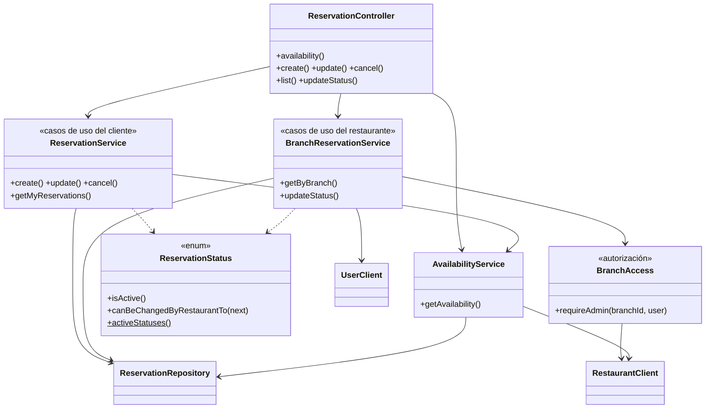

# ReservaYa — Análisis de estructura, POO y SOLID

Revisión del código (backend en Java/Spring Boot y frontend en JavaScript)
hecha durante la construcción del panel del administrador. Para cada
principio se indica **dónde se cumple**, **qué se corrigió** en esta revisión
y **qué queda pendiente**, con referencias a los archivos.

---

## 1. Resumen

| Aspecto | Estado | Comentario |
|---|---|---|
| Arquitectura | Bien | Microservicios por dominio (cuentas, restaurantes, reservas) con gateway único. |
| Capas dentro de cada servicio | Bien | Controlador → servicio → repositorio → entidad, con DTOs en los bordes. |
| **S** — Responsabilidad única | Mejorado | Se separaron casos de uso del cliente y del restaurante, y la autorización. |
| **O** — Abierto/cerrado | Mejorado | Las reglas de estado de una reserva viven en el enum `ReservationStatus`. |
| **L** — Sustitución de Liskov | Bien | Poca herencia y bien usada (filtros, excepciones). |
| **I** — Segregación de interfaces | Bien | DTOs y clientes REST pequeños, uno por caso de uso. |
| **D** — Inversión de dependencias | Bien, con matiz | Inyección por constructor en todo el backend; sin interfaces "de adorno". |
| Encapsulamiento del dominio | Mejorable | Entidades anémicas: las reglas están en los servicios. |
| DRY | Mejorado | Utilidades del frontend unificadas; queda duplicación de seguridad entre servicios. |
| Seguridad | Corregido | Se cerraron 4 fallos de autorización (sección 6). |
| Pruebas | Bien | 20 pruebas unitarias de reglas de negocio, sin base de datos. |

---

## 2. Estructura del proyecto

```
backend/
├── api-gateway/          Punto de entrada: enruta /api/** y aplica CORS
├── auth-service/         Dominio "cuentas": usuarios, login, Google, JWT
├── restaurant-service/   Dominio "oferta": restaurantes, sedes, horarios
├── reservation-service/  Dominio "reservas": disponibilidad, reservas, estados
└── db/schema.sql         Una base, tablas agrupadas por servicio
frontend/
├── html/                 Una página por pantalla
├── js/                   Un script por responsabilidad (ver 4.1)
└── styles/styles.css     Hoja única con tokens de diseño
```

Cada servicio sigue la misma organización en paquetes:

| Paquete | Responsabilidad | Ejemplo |
|---|---|---|
| `controller` | Traducir HTTP ↔ Java. Sin reglas de negocio. | `ReservationController` |
| `service` | Casos de uso y reglas de negocio | `ReservationService`, `BranchReservationService` |
| `repository` | Acceso a datos (Spring Data) | `ReservationRepository` |
| `entity` | Modelo persistido (JPA) | `Reservation`, `ReservationStatus` |
| `dto` | Contratos de entrada y salida de la API | `ReservationRequest`, `ReservationResponse` |
| `client` | Llamadas a otros servicios | `RestaurantClient`, `UserClient` |
| `security` | Autenticación y autorización | `JwtAuthenticationFilter`, `BranchAccess` |
| `exception` | Errores del dominio y su traducción a HTTP | `GlobalExceptionHandler` |

**Límites entre servicios.** Cada servicio es dueño de sus tablas y **no lee
tablas ajenas**. Cuando necesita un dato de otro dominio, lo pide por REST:
`reservation-service` consulta horario y aforo a `restaurant-service`
(`RestaurantClient`) y el nombre de los clientes a `auth-service` (`UserClient`).
Esto mantiene bajo el acoplamiento: se puede cambiar el modelo interno de un
servicio sin romper los otros, mientras respete su API.

Diagrama del servicio de reservas después de esta revisión:



---

## 3. Principios de POO

### Encapsulamiento

- **Bien:** las entidades JPA no salen de los servicios; la API siempre expone
  DTOs (`BranchResponse.from(branch)`, `ReservationResponse.from(r)`). Así, un
  cambio en la tabla no cambia el JSON que recibe el frontend.
- **Bien:** los secretos quedan dentro de su componente: la clave de los
  enlaces de recuperación solo existe en `PasswordResetTokens`, y el client ID
  de Google en `GoogleTokenVerifier`.
- **Mejorable — modelo anémico:** `Reservation`, `Branch` y `User` son bolsas
  de getters y setters, y las reglas ("solo se cancela si está activa y faltan
  2 horas") viven en los servicios. Cualquier clase podría hacer
  `reservation.setStatus(COMPLETED)` saltándose las reglas.
  *Primer paso dado:* las reglas de estado ya están en `ReservationStatus`
  (siguiente sección). *Siguiente paso sugerido:* métodos de dominio en la
  entidad (`reservation.cancel(reason, now, minHours)`,
  `reservation.moveTo(next)`) y quitar los setters públicos de `status`.

### Abstracción

- `AvailabilityService` oculta cómo se calculan las franjas (horario de la
  sede, franjas de una hora, cupo ocupado, franjas pasadas). Tanto la consulta
  de horarios como la creación de reservas usan ese mismo cálculo, así que es
  imposible reservar en una franja que el cliente no vio.
- `RestaurantClient` y `UserClient` ocultan la comunicación HTTP entre
  servicios: para el resto del código son llamadas a métodos normales.

### Herencia y polimorfismo

Se usan poco y donde corresponde: los filtros JWT extienden
`OncePerRequestFilter` de Spring, las excepciones del dominio extienden
`RuntimeException` y `GlobalExceptionHandler` las traduce a códigos HTTP
según su tipo. Se prefiere la **composición** (servicios que reciben sus
colaboradores por constructor) a las jerarquías de clases.

### Comportamiento en el objeto (corregido en esta revisión)

Antes, la regla de transiciones estaba escrita como una condición larga dentro
de `ReservationService.updateStatus`, y la pregunta "¿está activa?" se repetía
como `status == PENDING || status == CONFIRMED` en varios archivos. Ahora el
enum sabe responder por sí mismo:

```java
// entity/ReservationStatus.java
public boolean isActive() { return this == PENDING || this == CONFIRMED; }

public boolean canBeChangedByRestaurantTo(ReservationStatus next) {
    return switch (this) {
        case PENDING -> Set.of(CONFIRMED, REJECTED).contains(next);
        case CONFIRMED -> next == COMPLETED;
        default -> false;
    };
}
```

---

## 4. Principios SOLID

### S — Responsabilidad única (SRP)

> Una clase debe tener una sola razón para cambiar.

**Dónde se cumple**

| Clase | Su única responsabilidad |
|---|---|
| `GoogleTokenVerifier` | Validar un token de Google |
| `PasswordResetTokens` | Crear y verificar enlaces de recuperación |
| `ResetMailer` | Enviar el correo de recuperación |
| `AuthService` | Orquestar los casos de uso de la cuenta, delegando en los tres anteriores |
| `AvailabilityService` | Calcular franjas y cupos |
| `JwtProvider` | Firmar y leer tokens |

**Corregido en esta revisión**

1. **`ReservationService` tenía dos "clientes" distintos:** el comensal
   (crear, modificar, cancelar sus reservas) y el restaurante (ver las
   reservas de su sede y cambiarles el estado). Eran dos razones de cambio.
   Se separó en:
   - `ReservationService`: casos de uso del **cliente** (RF-06 a RF-09).
   - `BranchReservationService`: casos de uso del **restaurante** (RF-10, RF-11).
2. **La autorización quedaba mezclada en la lógica.** Ahora vive en
   `BranchAccess.requireAdmin(branchId, user)`, una regla con un solo lugar.
3. **Frontend:** `admin.js` mezclaba restaurantes, sedes y (ahora) reservas.
   Se dividió en `admin.js` (restaurantes y sedes) y `admin-reservas.js`
   (reservas del día), igual que el panel del cliente separa `cliente.js`
   (lista) de `reservar.js` (flujo de reserva).
4. `BranchService.update` borraba y recreaba los horarios. Se extrajo
   `replaceSchedules`, que además corrige un fallo real (sección 6).

**Pendiente:** `auth.js` empezó como "sesión" y hoy también contiene
utilidades generales (`apiFetch`, `formatDate`, `statusBadge`). Conviene
dividirlo en `sesion.js` y `api.js` si crece más.

### O — Abierto/cerrado (OCP)

> Abierto a extensión, cerrado a modificación.

- **Estados de reserva:** agregar un estado (por ejemplo "No asistió") ahora
  toca `ReservationStatus` y nada más en el backend: `BranchReservationService`
  pregunta `canBeChangedByRestaurantTo` sin conocer la tabla de transiciones.
- **Frontend:** las acciones del restaurante son una tabla de datos
  (`RESTAURANT_ACTIONS` en `admin-reservas.js`), y los colores de los estados
  otra (`RESERVATION_STATUS` en `auth.js`). Un estado nuevo es una línea más,
  no un `if` más.
- **Errores:** un tipo de error nuevo es una clase de excepción más un
  `@ExceptionHandler`; los servicios no conocen códigos HTTP. En esta revisión
  se agregó `ForbiddenException` → 403 sin tocar ningún servicio existente.

**Pendiente:** los roles son texto (`"SYSTEM_ADMIN"`, `"RESTAURANT_ADMIN"`)
repetido en `BranchAccess` y en `RestaurantService.verifyAdmin`. Un enum `Role`
compartido o un método `user.isSystemAdmin()` en `AuthenticatedUser` evitaría
errores de escritura.

### L — Sustitución de Liskov (LSP)

> Un subtipo debe poder usarse donde se espera su tipo base.

No hay jerarquías propias que puedan romperlo. Las extensiones del framework
(`OncePerRequestFilter`, `RuntimeException`) respetan el contrato de su clase
base: los filtros siempre llaman a `chain.doFilter` y las excepciones no
cambian el significado de `getMessage()`. **Sin hallazgos.**

### I — Segregación de interfaces (ISP)

> Ningún cliente debe depender de métodos que no usa.

- **DTOs por caso de uso:** crear o modificar una reserva usa
  `ReservationRequest` (4 campos); cambiar el estado usa `StatusUpdateRequest`
  (estado y motivo); la recuperación de cuenta usa `ForgotPassword` y
  `ResetPassword`. Ningún formulario manda campos que no le corresponden.
- **Repositorios con consultas concretas** (`findByBranchIdAndReservationDate`,
  `sumPartySizeBySlot`) en lugar de un método genérico con muchos parámetros.
- **Clientes REST pequeños:** `UserClient` solo sabe `findByIds`.

**Corregido en esta revisión:** el formulario del restaurante pedía dirección,
ciudad y capacidad, pero el contrato (`RestaurantRequest`) no los tiene: la
dirección se enviaba como *descripción* y el resto se perdía. El formulario
ahora pide solo lo que el contrato define (nombre, cocina, descripción), y la
dirección, el horario y el aforo quedan en la sede, que es donde el modelo los
guarda.

### D — Inversión de dependencias (DIP)

> Depender de abstracciones, no de detalles; recibir las dependencias desde fuera.

- **Inyección por constructor en todo el backend**, sin `new` de servicios ni
  `@Autowired` en campos. Esto permite que las pruebas armen cada servicio
  con dobles de prueba:

  ```java
  new BranchReservationService(repository, new BranchAccess(restaurantClient), userClient)
  ```

- **Los servicios dependen de interfaces de Spring Data**
  (`ReservationRepository`), no de JDBC ni de PostgreSQL.
- **La configuración entra por propiedades** (`@Value`, `@ConfigurationProperties`),
  nunca escrita en el código: URLs entre servicios, secretos, anticipación
  mínima para cancelar.

**Matiz consciente:** `RestaurantClient` y `UserClient` son clases concretas,
sin interfaz. Hoy hay una sola implementación de cada una y Mockito puede
simularlas igual, así que una interfaz sería código sin beneficio. Si algún
día hubiera una segunda implementación (por ejemplo, un caché), se extrae la
interfaz en ese momento.

---

## 5. Otras prácticas

### DRY (no repetirse)

**Corregido en el frontend.** Estas piezas estaban copiadas en varios archivos
y ahora viven una sola vez en `auth.js`:

| Utilidad | Antes | Ahora |
|---|---|---|
| Llamada a la API con 401 y errores | `api()`, `postJson()` y 7 bloques `fetch` en `admin.js` y `cliente.js` | `apiFetch()` |
| Mensaje de estado de formularios | 3 copias de `setStatus()` | `showStatus()` |
| Nombres y colores de estados | `cliente.js` | `RESERVATION_STATUS`, `statusBadge()` |
| Fecha legible y fecha de hoy | `cliente.js`, `reservar.js` | `formatDate()`, `todayIso()` |
| Lista de ciudades | escrita en el HTML del cliente, texto libre en el admin | `CITIES`, usada por ambos |

**Pendiente en el backend.** `JwtAuthenticationFilter`, `AuthenticatedUser`,
`JwtProperties` y `GlobalExceptionHandler` están copiados en los tres
servicios, y la zona horaria `America/Bogota` aparece en 7 clases. En
microservicios esto es parcialmente aceptable, porque cada servicio debe poder
desplegarse solo. Si la copia empieza a divergir, lo indicado es un módulo
Maven compartido (`reservaya-common`) con esas clases.

### KISS / YAGNI

Se evitó a propósito agregar capas sin uso: no hay interfaces con una sola
implementación, ni fábricas, ni una tabla nueva para los tokens de
recuperación (se firman con HMAC y se invalidan solos al cambiar la
contraseña). Las decisiones que tienen un límite conocido están marcadas en el
código con comentarios `ponytail:`, que explican el límite y cuándo cambiarlas.

### Acoplamiento en el frontend

Las páginas usan scripts clásicos que comparten el ámbito global:
`reservar.js` llama a `loadReservations()` de `cliente.js`, y `admin.js` avisa
a `admin-reservas.js` con `refreshReservationBranches()`. Funciona, y cada
dependencia está documentada en la cabecera de cada archivo, pero es
acoplamiento implícito. **Siguiente paso sugerido:** módulos ES
(`<script type="module">` con `import`/`export`), que hacen explícito qué usa
cada archivo, sin necesidad de un framework.

---

## 6. Fallos encontrados y corregidos en esta revisión

| # | Fallo | Impacto | Corrección |
|---|---|---|---|
| 1 | `GET /api/reservations?branchId=&date=` sin control de permisos | Cualquier usuario con sesión veía las reservas de cualquier restaurante | `BranchAccess.requireAdmin` |
| 2 | `PATCH /api/reservations/{id}/status` sin control de permisos | Un cliente podía confirmar o rechazar reservas ajenas | `BranchAccess.requireAdmin` |
| 3 | Editar el horario de una sede borraba y recreaba los 7 días | Hibernate inserta antes de borrar y choca con `UNIQUE (branch_id, day_of_week)`: editar horarios fallaba siempre | `BranchService.replaceSchedules` actualiza cada día en su sitio |
| 4 | Editar una sede sin enviar `active` la reactivaba | No se podía mantener una sede desactivada | El panel envía siempre `active`, con su casilla |
| 5 | Estado inválido en la URL (`?status=xyz`) | Error 500 | `parseStatus` responde 422 con un mensaje claro |
| 6 | Formulario de restaurante con campos que no se guardaban | Datos perdidos sin aviso | Formulario alineado con `RestaurantRequest` |
| 7 | Ciudad de la sede en texto libre | "Giron" sin tilde no aparecía al filtrar por "Girón" | Lista cerrada `CITIES` compartida con el buscador |

Todos tienen una prueba que falla si el arreglo se revierte
(`BranchReservationFlowTest`, `BranchUpdateTest`, prueba E2E del panel).

---

## 7. Deuda técnica priorizada

| Prioridad | Tema | Por qué importa | Propuesta |
|---|---|---|---|
| Alta | **Sobrecupo por reservas simultáneas** | Crear una reserva consulta el cupo y luego inserta. Si dos clientes reservan la misma franja al mismo tiempo, ambos pueden pasar la validación. El índice `uq_reservations_active_slot` solo impide que *el mismo usuario* reserve dos veces la misma franja. | Bloqueo pesimista de la franja (`SELECT ... FOR UPDATE` sobre la sede) o aislamiento `SERIALIZABLE` en `create`/`update` |
| Media | Modelo de dominio anémico | Las reglas se pueden saltar con un setter | Métodos de dominio en `Reservation` (sección 3) |
| Media | Seguridad duplicada en 3 servicios | Un arreglo hay que hacerlo 3 veces | Módulo `reservaya-common` |
| Media | Roles como texto | Errores de escritura silenciosos | `AuthenticatedUser.isSystemAdmin()` / enum `Role` |
| Baja | Scripts globales en el frontend | Dependencias implícitas | Módulos ES |
| Baja | Duración de la franja fija en código (1 hora) | Un restaurante con turnos de 2 horas no se puede modelar | Propiedad por sede |

---

## 8. Pruebas

| Servicio | Prueba | Qué cubre |
|---|---|---|
| auth-service | `AccountFlowTest` (5) | Recuperación de cuenta, Google, roles permitidos |
| reservation-service | `ReservationFlowTest` (8) | Disponibilidad, crear y modificar con validación de aforo y horario |
| reservation-service | `BranchReservationFlowTest` (5) | Permisos del restaurante, ciclo de estados, datos del cliente |
| restaurant-service | `BranchUpdateTest` (2) | Edición de horarios sin duplicar filas, desactivar sede |

Son pruebas unitarias con dobles (Mockito): no necesitan base de datos y
corren en segundos. Además hay un recorrido end-to-end en navegador (fuera
del repositorio) que cubre registro, login, recuperación, reserva,
modificación y todo el panel del administrador contra un gateway simulado.
